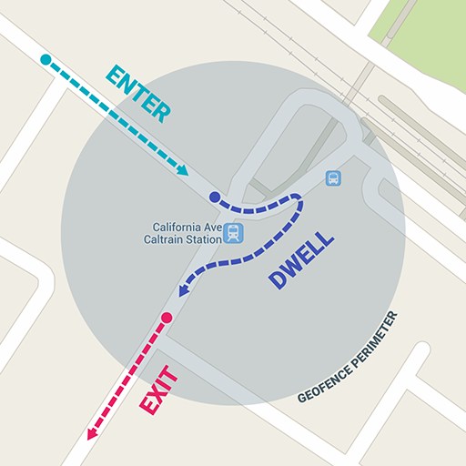
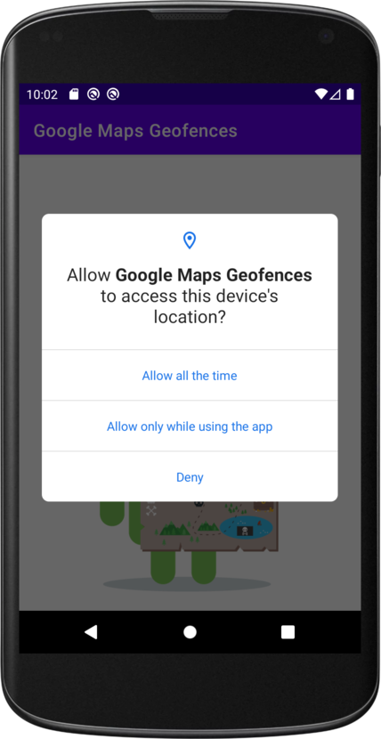
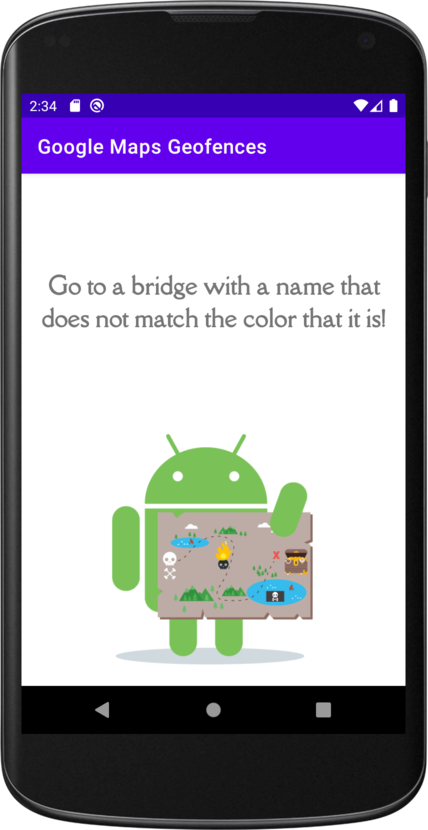

# Google Maps Geofencesr 	🏕️

Project created for the Udacity nanodegree Android Kotlin Developer program.

A geofence is a virtual perimeter defined by GPS or RFID around a real world area. Geofences can be created with a radius around a point location.

Geofences have three transition types:

1. Enter: Indicates that the user entered the geofence(s).
2. Dwell : Indicates that the user enters and dwells in geofences for a given period of time.
3. Exit: Indicates that the user has exited the geofence(s).

## Features ✨

- Permissions
- Broadcast Receivers
- Geofences
- Mock location

## Project Milestones

- How to check user permissions.
- How to check device settings.
- How to add Broadcast Receivers.
- How to add geofences.
- How to handle geofence transitions.
- How to mock locations in the emulator.

## Overview

